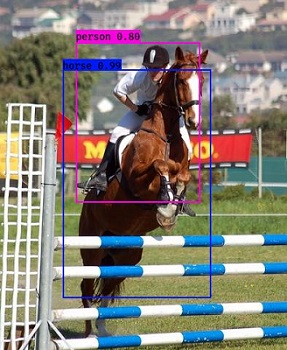
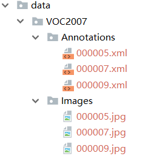
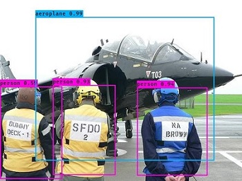
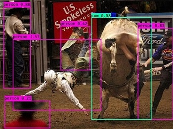
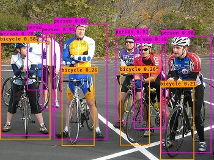
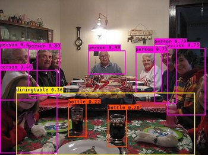

#     Easiest YoloV3 to Train Your Own Dataset

​                                                     

## Platform

* **Win10**, ```tensorflow-gpu 1.8.0```, ```cuda 9.0``` ```keras 2.2.4```, ```python 3.6``` on ```GTX1060``` 

* **Ubuntu 16.04**, ```tensorflow-gpu 1.8.0```, ```keras 2.2.4```,```python3.6```, ```cuda-9.0``` on ```GTX1080```

  ***!!!*** There is a tiny difference in codes you should pay attention to when tested on different platforms: the path ```data/VOC2007/Images/1.jpg``` in ubuntu should be ```data\\VOC2007\\Images\\1.jpg``` in windows. Related codes such as ```img_id = img.split('\\')[-1].split('.')[0]``` should also be corrected. That's very easy to do, right? Here I offer the codes executable in windows

## Introduction
This repo is used to train your own dataset from scratch.

And this repo is mainly modified from [qqwweee/keras-yolo3](https://github.com/qqwweee/keras-yolo3). 

## Establish Your Own Dataset

A popular tool to build our own dataset is [*Labelimg*](https://github.com/tzutalin/labelImg). Here it's not our focus how to use it, though it is very easy. With this tool, we can get the dataset including images and the corresponding ```.xml``` files. In my test, I referred to the online dataset [*Pascal VOC2007*](http://host.robots.ox.ac.uk/pascal/VOC/voc2007/VOCtrainval_06-Nov-2007.tar) and only left the images in ```VOCdevit/VOC2007/JPEGImages/``` and ```.xml``` files in ```VOCdevit/VOC2007/Annotations/```. Build the structure like below(The same to your own dataset):

 

Do ```python convert_data.py``` to produce the ```.txt``` file containing all the labels. Each line should be in the pattern ```path/image.jpg box1 box2 box3···```, and each box should be composed of five elements: ```x_min,y_min,x_max,y_max,class_id ```.

## Train

* Download the model zip containing pretrained models and my training model.([*Link*](https://www.jianguoyun.com/p/DVoaU2gQxcPVBxi9oNwB)). Unzip the downloaded file in your work path. To ensure the good performance of your network and consider the time consuming, I recommend that you'd better load the pretrained model  ```models/pre_weights/yolo_weights.h5``` and then fine tune, instead of training totally from scratch. You will find it useful to look through the referred repo [qqwweee/keras-yolo3](https://github.com/qqwweee/keras-yolo3) and know how to get this ```.h5``` file.
* Before training we should decide some hyper-parameters. The first is the classes in your dataset.  You should change the ```classes``` in ```config.py``` yourself. The second is the batch size and learning rate, for the training process contains two stages : one is the freeze stage where only the last several layers are trained, the other is the unfreeze stage requiring much more GPU memory.  The last and the crucial one is  the default anchors according to Yolo algorithm. Just do ```python Kmeans.py``` to get the ```./data/VOC2007/default_anchors.txt``` which contains 6 or 9 anchors depending on whether yolo net or tiny yolo net you choose. In my experiment, I choose the former.
* Start training. Do ```python train.py```. The training time depends on the scale of your dataset, the type of network you choose and your machine. For me, it takes several hours before it reached fair performance. During training, you can do ```tensorboard --logdir=./logs/``` and supervise the training and the validation loss.

## Test

I upload the ```./models/checkpoints/trained_weights_final.h5``` I trained using  [*Pascal VOC2007*](http://host.robots.ox.ac.uk/pascal/VOC/voc2007/VOCtrainval_06-Nov-2007.tar) . Try that if you'd like. You can also use the model trained with your own dataset. Change the test image path and output path in ```test.py```. Do ```python test.py``` and you will get the results. Enjoy it!

## Performance 

Here are some demos in my experiments.

​         

​         

